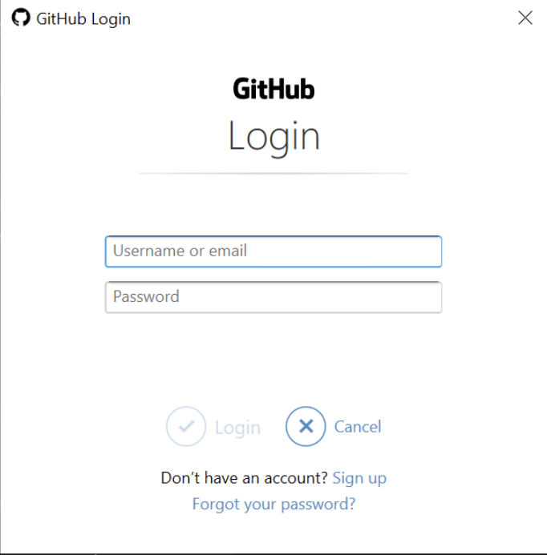

# git-newbie-playground
This is a repository for Git newbies to fork and play with. 


# Setup Git and GitHub
⚠️ Setting up Git on your local machine / laptop can be a bit of a pain and might not work the first time. I tried to describe a way that _should_ work. That being said, I could not test it extensively (because Git is already set up for me and I don't have access to a Windows machine). Please don't give up - once you have set it up correctly you don't need to do this again. ⚠️


## 1. Create GitHub account
- Create a GitHub account if you have not already: https://github.com/join

## 2. Install Git

### 2.1. Windows
- install Git: https://git-scm.com/download/win
- If you have Git installed already, please make sure that you have at **least version 2.29** (required for storing credentials securely): 
```
git version 
```
If you do not have at least version `2.29`, please update Git: 

```
git update-git-for-windows
```

### 2.2. Mac
- install Git, see [here](https://git-scm.com/book/en/v2/Getting-Started-Installing-Git)

### 2.3. Linux
- Git should already be installed on your machine. To check, please run: 
```
git version
```
If not, please google "install git {your distro}" and you should find out how to install it.

## 3. Introduce yourself to Git

Open a terminal (Mac / Linux) or Git Bash (Windows).

Copy each of the following commands, adapt the name and email address (the email address should be the address you used for your GitHub account), and hit enter.

```
git config --global user.name 'Jane Doe'
git config --global user.email 'jane@example.com'
```

## 4. Git going! 


### 4.1 Forking
To start working with this repository and changing things, you need your own copy of it. You achieve this by "forking" the original repo. Just select "Fork" in the menu above.


Now as you own a perfect copy of this repo, you can download it to your own machine. In git we call this "cloning".

To clone the repo we use the terminal (Mac / Linux) or Git Bash (Windows).

First we want to navigate to the folder on your machine where we want to store the repo. The command we use is ```cd```, which stands for "change directory" and ```mkdir``` which means "make directory. You can use ```cd```sequentually to find the right folder. This can look like the following on my machine.

```
cd Documents
cd Hack_and_Harvest
mkdir Git_Workshop
cd Git_Workshop
```
With these commands we navigated from my home folder to Documents and then into the folder "Hack_and_Harvest". Inside this folder we created the new folder "Git_Workshop" and afterwards navigated into this (so far) empty folder. Depending on how you your file system looks like, this will look different for you and you might have to adapt the folder names. To check where you are right now with the terminal you can use ```ls``` to get a list of folders and files inside your current (terminal) folder.


### 4.2 Cloning
When we finally arrive in our target folder where we want to store this repo, we can clone it!

Therefore just use:

```
git clone https://github.com/{your_github_username}/git-newbie-hack_and_harvest
```

If you are doing this the first time you will need to prove to Github who you are. Just fill in your Github username and passwort in the promt:

 

Git should clone your repository. You can confirm it is there by running `ls` in your Git bash window

```
ls
```

`git-newbie-hack_and_harvest` should be in the list.

Awesome! Now you can start playing around with the repo! 🚀

# Resources
## Read
- [Git Book - Git Basics Chapter](https://git-scm.com/book/en/v2/Git-Basics-Getting-a-Git-Repository): very good overview! 
- [Git our sh*t together - VSCode](https://gost.netlify.app/en/2019-12-01_correlaid-meetup-berlin/#1): a similar workshop to this one but with the excellent Git VSCode extension
- [Git bascis - Most important commands](https://rogerdudler.github.io/git-guide/): extremely helpful resource and 90% of commands you ever need!

## Practice 
- [Git Katas](https://github.com/muses-code-js/git-katas): command line Git through focused exercises
- [Learn Git Branching](https://learngitbranching.js.org/): interactive exercises to learn git branching
